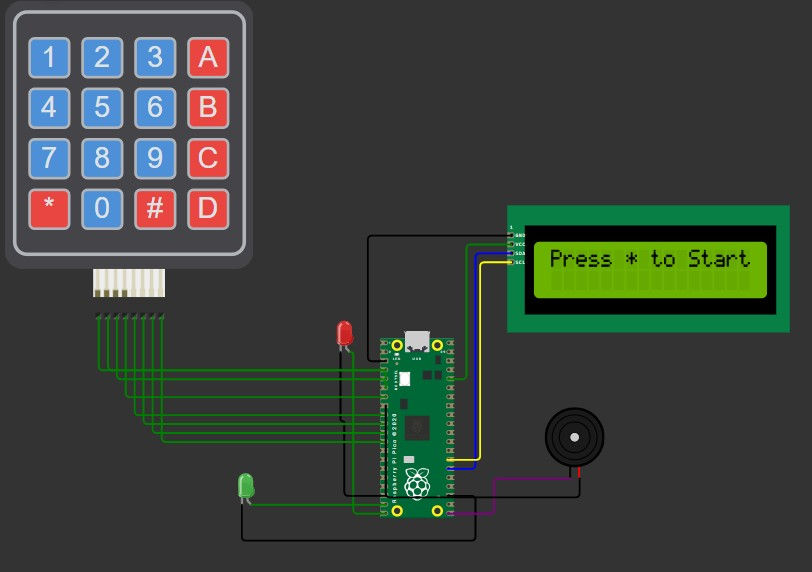

# Bare-Metal PIN Safe (Raspberry Pi Pico)

A bare-metal electronic safe/lock controller for the Raspberry Pi Pico (RP2040), built directly on the Pico SDK with no RTOS. It reads a 4x4 matrix keypad, drives a 16x2 character LCD over I2C (PCF8574 backpack), gives audio feedback through a PWM-driven buzzer, and signals state with red/green LEDs.

The system is a finite state machine with five states: `SLEEP`, `LOCKED`, `ENTERING_PIN`, `UNLOCKED`, and `LOCKOUT`, and it uses a GPIO interrupt to wake from a low-power sleep state instead of polling the keypad continuously.

---

## Features

* **4x4 matrix keypad input**, row/column scanned with audible click feedback per keypress.
* **16x2 I2C LCD** (PCF8574-based backpack) driven with a hand-rolled 4-bit HD44780 protocol implementation — no external LCD library required.
* **PIN entry** with masking (`*` shown in place of digits) and a live countdown/inactivity timeout.
* **Lockout protection** after 3 incorrect PIN attempts, with a flashing red LED and a 10-second cooldown.
* **Interrupt-driven sleep mode** — the device idles at low power and wakes only on a keypress via `GPIO_IRQ_EDGE_RISE`.
* **Non-blocking main loop** using a 1ms repeating hardware timer (`system_ticks`) for all timeouts/debouncing, so the state machine never busy-waits except for short, intentional UI pauses.
* **Status feedback** via dedicated red/green LEDs and buzzer tones (key click, success chime, error buzz).

---

## Hardware Requirements

| Component | Notes |
| :--- | :--- |
| Raspberry Pi Pico / Pico W | RP2040, runs at the default 125 MHz clock |
| 4x4 matrix keypad | Rows = outputs, columns = inputs (pull-down) |
| 16x2 character LCD | PCF8574-based backpack, default address `0x27` |
| Passive buzzer | Driven via PWM |
| 2x LEDs (red + green) + resistors | Status indication |

### Pinout

| Signal | GPIO |
| :--- | :--- |
| Red LED | `GP15` |
| Green LED | `GP14` |
| Buzzer (PWM) | `GP16` |
| I2C SDA (LCD) | `GP20` |
| I2C SCL (LCD) | `GP21` |
| Keypad rows | `GP2`, `GP3`, `GP4`, `GP5` |
| Keypad columns | `GP6`, `GP7`, `GP8`, `GP9` |

### Known Limitations / Security Notes

* The master PIN is hardcoded in flash (`MASTER_PIN`) and not encrypted or configurable at runtime — anyone with physical/USB access to the board can read it out of the binary.
* There's no persistent storage of lockout state or attempt count across a power cycle, so a reset clears any lockout.
* No debounce beyond the 50-tick (~50ms) scan throttle in the main loop; noisy switches may still register double presses in edge cases.
